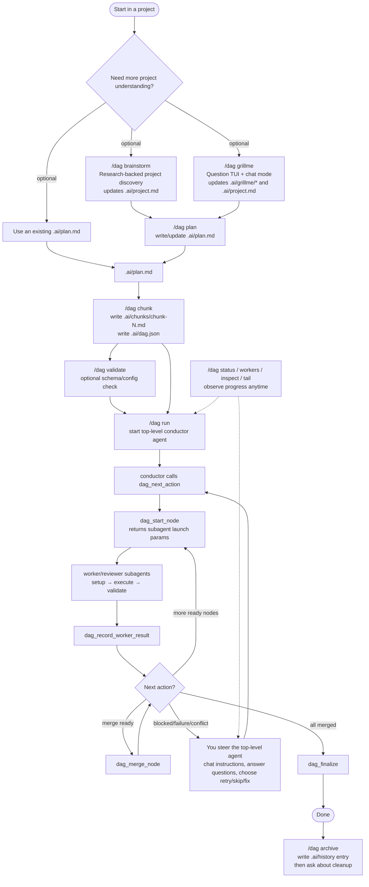

# pi-dag-workflow

Standalone Pi package for DAG-oriented project discovery, planning, chunking, and ordered subagent execution.

## Default behavior

The packaged prompts guide project discovery, decision interrogation, planning, chunking, worker discipline, and validation while preserving the default `setup -> execute -> validate` node flow. Project-specific setup, implementation, and validation details still belong in `.ai/project.md`, `.ai/plan.md`, chunks, and node instructions.

## Install

```nu
pi install git:git@github.com:from-nibly/pi-dag-workflow@v0.1.0
```

DAG execution uses the bundled `pi-subagents` runtime through a DAG-owned `dag_subagent` tool. You do **not** need to install `pi-subagents` separately for `/dag run`.

Install `pi-subagents` separately only if you also want its general-purpose `subagent` tool, slash commands, skills, or prompt templates outside the DAG workflow.

## Commands

All user commands are under `/dag`:

```text
/dag brainstorm   # research and map project understanding in .ai/project.md
/dag grillme      # interactive GrillMe TUI for many questions
/dag plan         # write .ai/plan.md
/dag chunk        # write .ai/chunks and .ai/dag.json
/dag validate     # validate .ai/dag.json
/dag run          # start conductor prompt
/dag status       # show latest run status
/dag workers      # summarize worker records
/dag review       # reviewer prompt
/dag retro        # retrospective prompt
/dag archive      # write .ai/history entry, then ask about cleanup
```

## Usage flow

You can use any combination of `/dag brainstorm`, `/dag grillme`, and `/dag plan` as long as you end up with `.ai/plan.md`. Then `/dag chunk` creates `.ai/chunks/*` and `.ai/dag.json`, and `/dag run` starts the top-level conductor agent.



During `/dag run`, you steer the **top-level conductor agent**, not each worker directly. You can provide additional instructions in chat, ask it to inspect status, choose recovery actions, or stop and revise chunks/config before continuing.

After `/dag chunk` writes `.ai/chunks/*` and `.ai/dag.json`, it prints a compact text dependency diagram directly in the terminal output. The diagram is generated from `nodes[].dependsOn` and includes first-ready chunks and `maxConcurrency` when available:

```text
DAG valid: .ai/dag.json

chunk-1  Add renderer helper             deps: -
chunk-2  Update chunk prompt             deps: -
chunk-3  Document diagram output         deps: chunk-1, chunk-2

Dependency sketch:
chunk-1 ─┐
         ├─> chunk-3
chunk-2 ─┘

First ready: chunk-1, chunk-2
maxConcurrency: 2
```

After a run or planning cycle, `/dag archive` writes a durable history file such as `.ai/history/YYYY-MM-DD-HH-MM-<type>-<slug>.md` first, then asks whether you want to clean up old DAG artifacts. Cleanup is never automatic; files are deleted or moved only after explicit confirmation after the history file has been created.

## Config

Config files are optional JSON files:

- User-global config path: `~/.pi/agent/extensions/dag-workflow/config.json`
- Project config path: `.ai/dag.config.json`

Merge order is package defaults → user-global config → project config → inline/generated DAG choices. Later layers override earlier scalar/object fields. `steps` are merged by `id`, `flows` are merged by flow name, and `nodeFlowOverrides` are appended so later project entries can override earlier user entries when multiple patterns match.

Top-level `steps` is an array of reusable step definition objects. Top-level `flows` is a map of flow names to ordered arrays of flow step objects. Flow step objects require `id` and may override any step field, including `agent`, `model`, and `thinking`.

The packaged default flow is `setup -> execute -> validate` using `builtin:worker` and `builtin:reviewer`. Keep this as the default for ordinary DAGs; add reusable specialist flows only as opt-in choices selected by a node `flow` or by `nodeFlowOverrides`.

`nodeFlowOverrides` entries have `{ "match": "pattern", "flow": "flowName" }`. Runtime matching supports exact node id matches plus glob-ish `*`/`?` matches against node id, title, `chunkFile`, and chunk filename. If several entries match, the last matching entry wins.

External side-effect validation should be opt-in. Validators should classify evidence as `unit/static`, `help smoke`, `mocked behavioral`, or `live external`, and should explicitly call out external workflows that were not live-tested. Do not make live external validation the default flow.

Example opt-in flow pattern for a workflow that intentionally validates an external CI loop:

```json
{
  "steps": [
    {
      "id": "wci-ci-loop-validate",
      "kind": "agent",
      "agent": "builtin:reviewer",
      "prompt": "builtin:validator",
      "input": "Validate the WCI CI loop only when node.validationInstructions explicitly opt in to live external validation.",
      "output": "Classify evidence, identify live external checks performed or skipped, and end with VERDICT: PASS or VERDICT: FAIL.",
      "requires": ["External side effects were explicitly requested or skipped with residual risk called out."],
      "onFail": "retry:execute"
    }
  ],
  "flows": {
    "wci-ci-loop": [
      { "id": "setup" },
      { "id": "execute" },
      { "id": "wci-ci-loop-validate" }
    ]
  },
  "nodeFlowOverrides": [
    { "match": "wci-*", "flow": "wci-ci-loop" }
  ]
}
```

`merge` is top-level, step-shaped, has no ordering fields, and is appended implicitly after every node flow. Before a pending node starts, its clean worktree is refreshed from the current parent branch after hard dependencies have merged so dependent chunks can see upstream commits. Dirty node worktrees block with a `needs_decision` status. `dag_merge_node` rebases the node worktree onto the current parent commit, verifies node commit subjects are Conventional Commits, then fast-forwards the parent branch. It does not create merge commits such as `Merge DAG node ...`.

## DAG shape

```json
{
  "schemaVersion": 1,
  "run": {
    "name": "example",
    "plan": ".ai/plan.md",
    "maxConcurrency": 2
  },
  "defaults": { "flow": "default", "mergeStrategy": "rebase-ff" },
  "steps": [
    { "id": "setup", "kind": "agent", "agent": "builtin:worker", "prompt": "builtin:setup" },
    { "id": "execute", "kind": "agent", "agent": "builtin:worker", "prompt": "builtin:executor" },
    { "id": "validate", "kind": "agent", "agent": "builtin:reviewer", "prompt": "builtin:validator" }
  ],
  "merge": { "id": "merge", "kind": "merge", "onConflict": "resolve" },
  "flows": {
    "default": [{ "id": "setup" }, { "id": "execute" }, { "id": "validate" }]
  },
  "nodeFlowOverrides": [],
  "nodes": [
    {
      "id": "chunk-1",
      "title": "Example chunk",
      "chunkFile": ".ai/chunks/chunk-1.md",
      "dependsOn": [],
      "ownedFiles": ["src/example.ts"],
      "forbiddenFiles": []
    }
  ],
  "edges": []
}
```

Project/chunk-specific setup, implementation, and validation details belong on node instructions (`setupInstructions`, `implementationInstructions`, `validationInstructions`), not in builtin prompt markdown.

## GrillMe

`/dag grillme` installs a vim-like Pi TUI editor:

- `Esc`: nav mode
- nav: `h` previous, `l` next, `j/k` option, `Enter` answer selected option, `a` freeform answer, `c` chat, `x` complete
- answer: `Enter` save, `Shift+Enter` newline
- chat: `Enter` asks the top-level agent

Pressing `x` completes and closes the GrillMe session, discards unanswered questions, and asks the agent to call `dag_grillme_get_answers` to read only `{ id, title, body, answer }` for answered/non-discarded questions. The agent should synthesize those answers into `.ai/project.md`.

Durable state lives in `.ai/grillme/grillme-N.json`. Research summaries and source links should be recorded in `.ai/project.md`.
